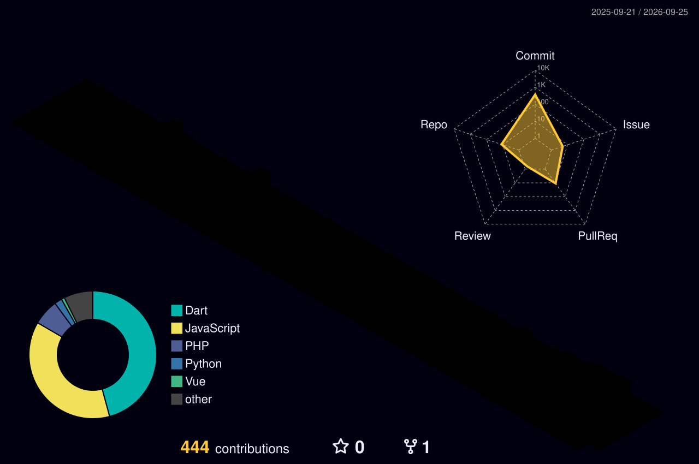
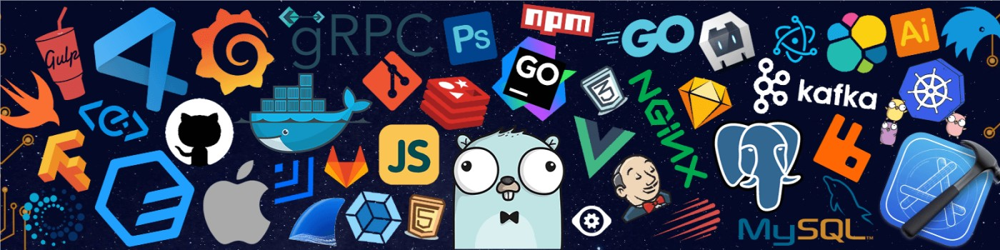

  

<table>
  <tr>
    <td width="65%" valign="top" align="justify">

I’m a Software Engineering Technology student at Politeknik Negeri Batam. I enjoy building software, exploring new technologies, and understanding how different parts of a system work together.

My main interests are software engineering, web and mobile development, backend systems, system design, cloud computing, and DevOps. I’m particularly interested in how software can be designed beyond individual features, from the way components interact to how a system is developed, tested, and maintained.

Most of the projects here are things I’ve built while studying, experimenting, or working with others. Some are small experiments, while others are larger projects developed as part of a team. I use my repositories to document the things I build, the technologies I explore, and how my approach to software development continues to develop.

I also enjoy learning through collaboration, discussing ideas with others, and working on projects where I can learn something new along the way.

If you’d like to connect or collaborate, feel free to reach out on [LinkedIn](https://www.linkedin.com/in/diva-satria-18159430a/).
    </td>
    <td width="35%" align="center" valign="middle">
      
    </td>
  </tr>
</table>

  

---

  

  

---

  

  

---

  

<!---
Divasatria100/Divasatria100 is a ✨ special ✨ repository because its README.md (this file) appears on your GitHub profile.
You can click the Preview link to take a look at the changes.
--->
